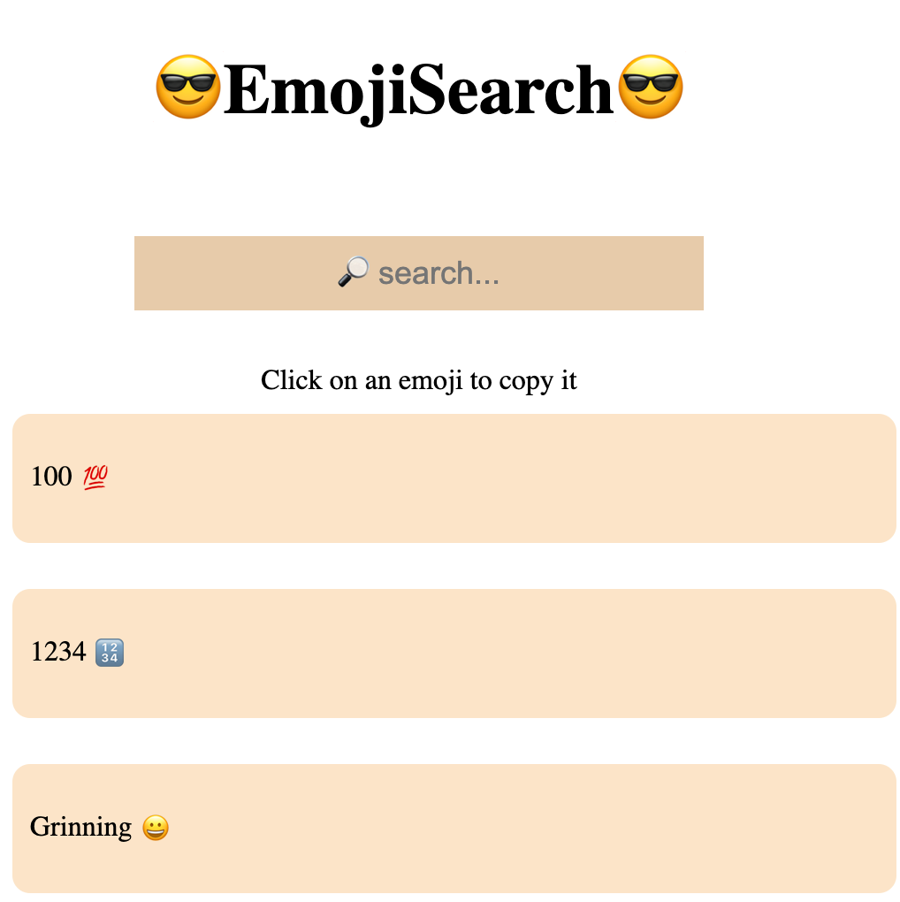

# 😎 EMOJI SEARCH

Emoji Search vous permet de chercher des emojis dans une liste et de les copier dans le presse-papier

## Getting started :

- create a create-react-app
- launch it
- understand architecture of boilerplate

## GUIDELINES :

- the file emojis.json contains all the emojis you will need

- in App.js you will call to components : Line and SearchBar
- create a component Line.js : it displays ONE emoji and it's text 
- create a component SearchBar.js : when the user write something, the emoji's list update with the right suggestions

À vous de jouer!!

## Bonus :

* améliorez les fonctionnalités de recherche

* Améliorez le rendu visuel